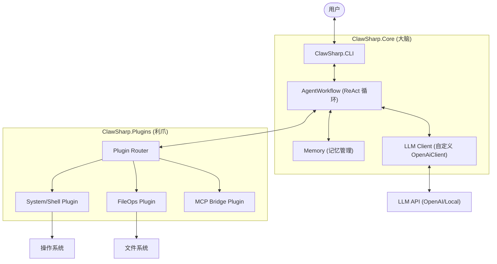

# 01 - 架构与项目概览 (Architecture & Overview)

## 1. 项目概述
ClawSharp 是一个基于 .NET 10 构建的跨平台、高性能本地智能体 (AI Agent) 网关。它旨在利用 C# 的强类型安全性和 NativeAOT 的极致性能，为开发者提供一个可控、安全且低延迟的 AI 执行环境。

### 核心目标
- **极致性能**：通过 NativeAOT 编译，实现毫秒级启动和极低内存占用。
- **系统级控制**：直接调用底层系统 API 或 Shell，实现对操作系统的深度控制。
- **安全沙箱**：引入人机协作 (Human-in-the-loop) 机制，确保高危操作必须经过审批。
- **标准化适配**：支持 MCP (Model Context Protocol) 协议，无缝对接生态插件。

---

## 2. 架构设计

### 2.1 架构流程图 (Architecture Flow)



### 2.2 项目目录结构

```text
ClawSharp/
├── src/
│   ├── ClawSharp.CLI/           # 启动入口 (Console App)
│   │   ├── Program.cs           # 初始化 Spectre.Console 和依赖注入
│   │   └── UI/                  # 渲染流式文本、审批提示框的组件
│   ├── ClawSharp.Core/          # 核心类库 (Class Library)
│   │   ├── WorkflowFactory.cs   # 工作流与 LLM 客户端的构建配置
│   │   ├── Memory/              # 上下文记忆的压缩与持久化 (JSON/SQLite)
│   │   └── AgentWorkflow.cs     # 定义大模型的思考循环 (Think -> Act -> Observe)
│   └── ClawSharp.Plugins/       # 所有的“利爪”动作 (工具库)
│       ├── System/              # ShellCommandPlugin.cs (带权限检查)
│       ├── FileOps/             # ReadFilePlugin.cs, WriteFilePlugin.cs
│       └── Mcp/                 # MCPClientBridge.cs (模型上下文协议解析)
├── tests/
│   └── ClawSharp.Core.Tests/    # 单元测试，确保系统级命令解析不出错
├── ClawSharp.slnx               # 现代化 XML 解决方案文件
└── Directory.Build.props        # 配置全局 NativeAOT 和 C# 规范
```

---

## 3. 技术栈
- **运行时**: .NET 10.0 (LTS)
- **语言**: C# 14
- **编译模型**: NativeAOT (强制要求)
- **UI 框架**: Spectre.Console
- **内核框架**: 自研轻量级 ReAct 引擎 (不使用 Semantic Kernel，极致 AOT 友好)
- **配置与注入**: Microsoft.Extensions (Configuration/DependencyInjection/Logging)

---

## 4. 路线图 (Roadmap)

### Phase 1: 核心基础 (已启动)
- [x] 基础项目骨架与 NativeAOT 配置。
- [x] 基于自定义 ReAct 引擎的 `AgentWorkflow`。
- [x] 基础 CLI 交互与流式渲染。
- [x] 单元测试框架搭建。

### Phase 2: “利爪”插件系统 (当前重点)
- [ ] **System 插件**: 跨平台 Shell 命令执行，支持超时控制。
- [ ] **FileOps 插件**: 安全受限的文件读取、写入与目录遍历。
- [ ] **权限审批流**: CLI 层拦截高危 Action，弹出 Spectre.Console 审批框。
- [ ] **插件自动发现**: 简化新插件的注册逻辑。

### Phase 3: 记忆与上下文管理
- [ ] **多级记忆**: 实现 `Memory/` 模块，支持基于 JSON 的长期记忆存储。
- [ ] **上下文压缩**: Token 接近阈值时自动生成历史摘要 (Summary Strategy)。
- [ ] **检索增强 (RAG)**: 本地嵌入 (Embedding) 模型适配，实现语义搜索。

### Phase 4: 生态与协议兼容
- [ ] **MCP 桥接**: 完整支持 Model Context Protocol，可直接加载外部标准插件。
- [ ] **复杂任务规划**: 在单层 ReAct 基础上引入子任务分解能力。

### Phase 5: 优化与发布
- [ ] **AOT 体积优化**: 剪裁不必要的元数据，单执行文件控制在 20MB 以内。
- [ ] **内存指纹**: 优化 `IAsyncEnumerable` 在大规模数据下的内存占用。
- [ ] **跨平台包发布**: 自动化 CI/CD 生成 Win/Linux/macOS 的 AOT 二进制包。
